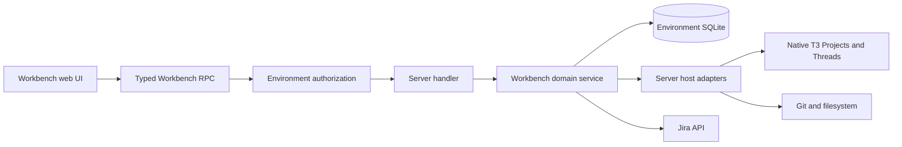

# Workbench architecture

Workbench is a planning layer inside a T3 Code environment. It owns Workbench Workspaces, Epics, Tickets, repository scope, Ticket Workspaces, Assignments, and Jira mirrors. T3 Code remains the owner of Projects, Threads, provider execution, Git, and checkpoints. Workbench records refer to native Project and Thread IDs instead of copying those records. A Workbench Workspace belongs to one environment; boards that span environments are not part of this model.

## Module boundaries

| Layer                                                                   | Responsibility                                                                                                                                                                         |
| ----------------------------------------------------------------------- | -------------------------------------------------------------------------------------------------------------------------------------------------------------------------------------- |
| [Workbench contract modules](../../packages/contracts/src/workbench.ts) | Wire schemas for Workbench records, Jira records, snapshots, and RPC inputs and results.                                                                                               |
| [`packages/workbench`](../../packages/workbench)                        | Domain rules, Workbench persistence and schema, Ticket Workspace rules, and Jira synchronization. It depends on interfaces for host capabilities and does not import application code. |
| [`apps/server/src/workbench`](../../apps/server/src/workbench)          | Environment-specific adapters for native records, Git, configuration, credentials, and the HTTP client; service composition, reactors, RPC handlers, and authorization.                |
| [`apps/web/src/workbench`](../../apps/web/src/workbench)                | React UI and environment-scoped queries and commands. Desktop uses this web UI inside Electron.                                                                                        |

The product UI says **Workbench Workspace** to distinguish it from a native T3 Project. Existing `WorkbenchProject` types, RPC names, and `workbench_projects` storage names retain the older term for compatibility. [Contracts](../../packages/contracts/src/workbench.ts) and [schema](../../packages/workbench/src/WorkbenchSchema.ts) use those names.

## Request and ownership flow

The UI selects an environment before issuing commands. The server checks the Workbench RPC's environment scope, then passes the request to a composed Workbench service. Domain code owns the rule, including Jira request behavior. Server adapters supply environment-specific native reads and effects, HTTP client, configuration, and credentials. The Workbench page also reads native Project state through the existing T3 client path. [Web state](../../apps/web/src/workbench/state.ts), [RPC authorization](../../apps/server/src/workbench/rpcAuthorization.ts), [handlers](../../apps/server/src/workbench/workbenchRpcHandlers.ts), and [service composition](../../apps/server/src/workbench/serverLayer.ts) show the path.

Workbench and native T3 persistence share the environment's SQLite database and SQL client. The server adapter reads native Project and Thread projections for Workbench operations; it uses the caller's SQL transaction when those reads participate in a Workbench write. The Workbench package cannot import server or web code, including through test helpers. Its [boundary check](../../packages/workbench/check-boundary.mjs) verifies the resolved source and workspace dependency graph. [Native access interface](../../packages/workbench/src/WorkbenchNativeAccess.ts) and [server adapter](../../apps/server/src/workbench/WorkbenchNativeAccess.ts) define this seam.

## Schemas and lifecycle

Wire contracts describe client/server messages and decoded snapshots. They are not copies of SQLite rows. [`WorkbenchSchema.ts`](../../packages/workbench/src/WorkbenchSchema.ts) owns the Workbench database shape and migration ledger; store and repository code maps rows to the public contract. Compatibility defaults on snapshots allow older servers to omit newer fields, while server-controlled revisions reject stale Ticket writes. Changes to persisted or wire shapes must account for both boundaries. See [Workbench data model](workbench-data-model.md).

Ticket preparation and Assignment history cross into native Git and Thread ownership; see [Ticket lifecycle](workbench-ticket-lifecycle.md). Jira bindings and synchronization have a separate external boundary; see [Jira mirrors](workbench-jira-mirror.md) and [Jira OAuth credential custody](workbench-jira-oauth.md). Fork integration and upstream sync rules remain in [Maintaining the Workbench fork](workbench-fork.md).
