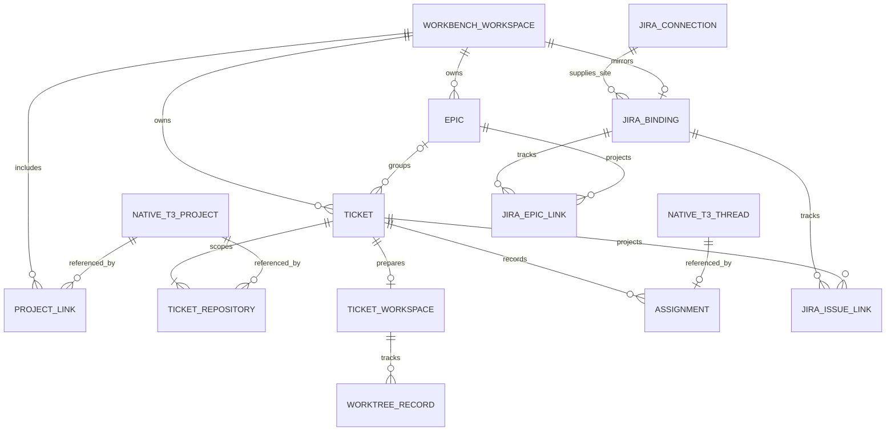

# Workbench data model

Workbench stores planning and delivery records in each T3 server environment's SQLite database. It shares the database with native T3 projections, but owns its own tables and schema migrations. A **Workbench Workspace** is the planning container stored as `workbench_projects`; it is distinct from a native T3 Project. The existing `WorkbenchProject` names in code and storage remain for compatibility. See the [schema initializer](../../packages/workbench/src/WorkbenchSchema.ts) and [native projection schema](../../apps/server/src/persistence/Migrations/005_Projections.ts).

## Relationships

The diagram shows conceptual relationships. Native T3 Project and Thread references are IDs, not SQL foreign keys to their projection tables. The server adapter reads those projections through the same SQL client used by Workbench writes, so store operations can check that referenced records are live. See [WorkbenchNativeAccess](../../apps/server/src/workbench/WorkbenchNativeAccess.ts) and [WorkbenchStore](../../packages/workbench/src/WorkbenchStore.ts).

| Record                                 | Role and constraint                                                                                                                                           |
| -------------------------------------- | ------------------------------------------------------------------------------------------------------------------------------------------------------------- |
| Workbench Workspace and Project link   | A Workspace groups planning records and an ordered set of native repository Projects.                                                                         |
| Epic and Ticket                        | Both belong to one Workspace. A Ticket can belong to one Epic in that Workspace.                                                                              |
| Ticket repository and Ticket Workspace | A Ticket has a non-empty ordered repository scope with one primary Project. Its optional Ticket Workspace tracks branch preparation and repository worktrees. |
| Assignment                             | Links a Ticket to one native Thread. A Thread ID is unique across Assignments; superseded rows retain history.                                                |
| Jira connection and binding            | A connection identifies an accessible Jira site. At most one binding attaches a Workbench Workspace to a Jira board and selected sprints.                     |
| Jira issue and Epic links              | Connect remote Jira issues to stable local Tickets and Epics. Creation records also track pending or uncertain outbound Jira creates.                         |

These constraints come from the [table keys and relationships](../../packages/workbench/src/WorkbenchSchema.ts), [Ticket scope validation](../../packages/workbench/src/WorkbenchStore.ts), and [Jira repository](../../packages/workbench/src/jira/WorkbenchJiraRepository.ts). Jira connection rows keep a credential ID; token storage is described in [Jira OAuth credential custody](workbench-jira-oauth.md).

## Ownership and transaction boundary

`packages/workbench` owns the schema initializer, persistence rules, and the `workbench_schema_migrations` ledger. The ledger is separate from native T3 migration numbering. The server supplies the SQLite layer and native Project and Thread reads through an adapter; the Workbench package does not import application code. See [schema initialization](../../packages/workbench/src/WorkbenchSchema.ts), [store composition](../../apps/server/src/workbench/WorkbenchStore.ts), and [server layer](../../apps/server/src/workbench/serverLayer.ts).

Workbench uses SQL transactions for related local changes, such as Ticket and repository rows, Assignment replacement, and Jira reconciliation. Native reads within a Workbench transaction use the caller's SQL client and connection, so an ownership check observes the same database boundary as the write. External Git, native Thread creation, Jira API calls, and secret-file writes have separate lifecycles; a SQLite transaction cannot commit them atomically. See [WorkbenchStore](../../packages/workbench/src/WorkbenchStore.ts), [Jira repository](../../packages/workbench/src/jira/WorkbenchJiraRepository.ts), and [Ticket Workspace service](../../apps/server/src/workbench/TicketWorkspaceService.ts).

The key application invariants are:

- A Ticket's primary native Project belongs to its Workspace's linked Projects and appears in the Ticket's repository scope.
- An Epic assigned to a Ticket belongs to the same Workspace. Archived Epics cannot receive new Tickets.
- An Assignment references a live native Thread in the Ticket's primary Project when it is created. Historical Assignment rows remain after replacement.
- Jira sync preserves stable local Ticket IDs and their native Thread history when Jira issues leave the selected sprints.

These rules are enforced by [WorkbenchStore](../../packages/workbench/src/WorkbenchStore.ts) and [Jira reconciliation](../../packages/workbench/src/jira/JiraSyncService.ts), rather than by foreign keys to native or remote systems.
