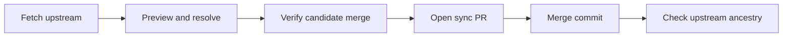

# Maintaining the Agent Workbench fork

The fork keeps T3 Code as the owner of execution and adds Workbench planning in an isolated overlay. Upstream changes enter the product branch through verified merge pull requests. Start with [Workbench architecture](workbench-architecture.md) for module boundaries and request flow, or [Workbench data model](workbench-data-model.md) for storage ownership.

## Isolation boundary

| Source                                    | Ownership rule                                                                                                                                           |
| ----------------------------------------- | -------------------------------------------------------------------------------------------------------------------------------------------------------- |
| `packages/workbench`                      | Own Workbench domain rules, schema, persistence, Ticket Workspace lifecycle, and Jira logic. Do not import applications, including through test helpers. |
| `apps/server/src/workbench`               | Adapt Workbench to native Project and Thread projections, Git, configuration, credentials, authorization, and server composition.                        |
| `apps/web/src/workbench`                  | Compose the React Workbench UI. Keep native T3 Threads as the conversation experience.                                                                   |
| Workbench modules in `packages/contracts` | Own wire schemas and RPC contracts. Keep shared T3 integrations thin.                                                                                    |
| `apps/desktop/src/workbench`              | Own fork distribution policy; do not point Workbench at the upstream updater.                                                                            |

Workbench stores references to native `ProjectId` and `ThreadId` values rather than copying T3 records. Its package shares the server process and database with T3, but owns a separate `workbench_schema_migrations` ledger. Server adapters supply native reads and host effects through typed services. Native reads that participate in Workbench writes must use the caller's SQL client and transaction; a separate connection or preloaded snapshot can break writer-lock ordering and ownership checks. [Architecture](workbench-architecture.md) and [data model](workbench-data-model.md) explain the boundary.

Before changing an upstream-owned file, check whether a Workbench adapter or extension point can own the behavior. Keep any remaining integration small and preserve behavior outside Workbench. [Ticket lifecycle](workbench-ticket-lifecycle.md), [Jira mirrors](workbench-jira-mirror.md), and [Jira OAuth custody](workbench-jira-oauth.md) describe the fork-owned behavior that crosses native or external boundaries.

## Package checks

Run the focused checks from the repository root when their scope applies:

```sh
vp run --filter @t3tools/workbench typecheck
vp run --filter @t3tools/workbench test
vp run workbench:quality
```

The typecheck includes the [package boundary check](../../packages/workbench/check-boundary.mjs). The [quality workflow](../../.github/workflows/workbench-quality.yml) runs the package checks and production quality gates. Tests for native migration integration stay in the server; independent package tests use package-owned fixtures. Read the current scripts and workflow for their exact gates rather than treating this page as a second configuration source.

## CI ownership

Keep `.github/workflows/ci.yml` and `thread-transfer-report.yml` identical to the upstream versions integrated into the product. Trust upstream CI for unchanged upstream functionality. [The generator](../../scripts/workbench-ci.ts) owns the fork's `workbench-ci.yml`; it does not copy upstream jobs. [Its ownership policy](../../scripts/workbench-ci-scope.json) maps Workbench sources and exact native integrations to existing tests, application typechecks, builds, or separate Workbench verification lanes. All fork-differing tests with a central runner are included, and an unmapped fork runtime source, rename, or deletion stops CI for review. Workbench native auth, Git/PR, restart, provider-summary, desktop identity, and shared runtime changes remain fork responsibilities even outside Workbench directories.

The policy compares the fork with its pinned integrated upstream commit. During a verified upstream merge, the sync workflow runs `node scripts/workbench-ci.ts --upstream upstream/main` before committing the candidate. This advances the baseline only through the canonical upstream remote, existing upstream ancestry, and an integrated or pending merge; remaining fork differences must still have owners. Regenerate the workflow after changing the policy or generator. Do not advance the baseline to a fork commit or classify a new responsibility as upstream merely to pass CI.

**Workbench feature CI** detects scope on every PR and `main` push. Product and tooling changes run focused checks; packaging inputs run shared packaging/version/manifest tests; docs-only changes need scope and the aggregate gate. `Workbench Check` retains its name and fails on scope errors, missing decisions, applicable failures or cancellations, and unexplained skips. Keep Workbench quality, browser/Jira regression, demo, preview, and release workflows separate. The fork-generated native transfer-budget reporter is removed: its synthetic upstream traffic does not exercise Workbench, whose persistence and transport integrations have focused coverage.

The inherited **CI** remains manually disabled. This setting lives outside Git; retaining the source preserves upstream ownership, while enabling it would queue unrelated Blacksmith jobs. Keep existing required checks and branch protections intact when changing CI ownership.

Inherited automatic workflows for mobile, the production relay, upstream releases, upstream macOS previews, and Cursor hygiene live in [`.github/upstream-workflows`](../../.github/upstream-workflows). GitHub does not discover that directory. Their YAML contents are retained unchanged so Git can carry upstream edits through the renames. Review new or restored files under `.github/workflows` during every upstream sync; a new upstream workflow is not automatically appropriate for this fork.

Keep the documented opt-in web preview, manual diagnostic and screenshot tools, and reusable release helpers in the active directory. These do not start unrelated builds on ordinary Workbench pushes. Unchanged mobile, Rust, relay, upstream release trains, and unrelated package suites do not run in routine Workbench CI. Shared dependencies remain exercised through the fork's application typechecks, builds, and mapped integration tests. Restoring an archived workflow requires a separate decision about its triggers, runner, distribution identity, and deployment authority.

## Upstream sync

The fork's `main` in `filipgutica/t3code` is the long-lived product branch. In this clone, `origin` points to the fork and `upstream` to `pingdotgg/t3code`. Preview a sync before merging:

```sh
git fetch upstream main
node scripts/workbench-upstream-sync.ts --product main --upstream upstream/main
```

The preview is read-only. It reports ancestry, files changed on both sides, and merge-tree conflicts. The [sync workflow](../../.github/workflows/workbench-upstream-sync.yml) builds and checks a candidate merge, then opens or updates a PR against the fork's current base. Its write step publishes only the verified two-parent merge commit after checking the exact base and head. A PR created by `GITHUB_TOKEN` does not start another workflow run, so the sync workflow's focused gates are its verification boundary.



Merge an upstream-sync PR with **Create a merge commit** or `gh pr merge --merge`. Squash and rebase discard upstream ancestry and make later syncs revisit already-integrated changes. After merging, use the exact upstream SHA recorded by that sync:

```sh
git fetch origin main
git merge-base --is-ancestor "$SYNCED_UPSTREAM_SHA" origin/main
```

Exit code zero confirms that the recorded upstream commit is an ancestor of the product branch. Do not substitute the latest `upstream/main`, which may have advanced. Accept a sync only after resolving every non-generated conflict and checking Workbench contracts, store, authorization, relevant UI behavior, application typechecks, and the desktop smoke test. The [sync workflow](../../.github/workflows/workbench-upstream-sync.yml) owns the current gate list. Treat any new edit outside Workbench-owned directories as an ongoing upstream maintenance cost.

Release the fork from its `main` through a separate fork-owned distribution channel. Upstream releases do not contain the Workbench overlay.
