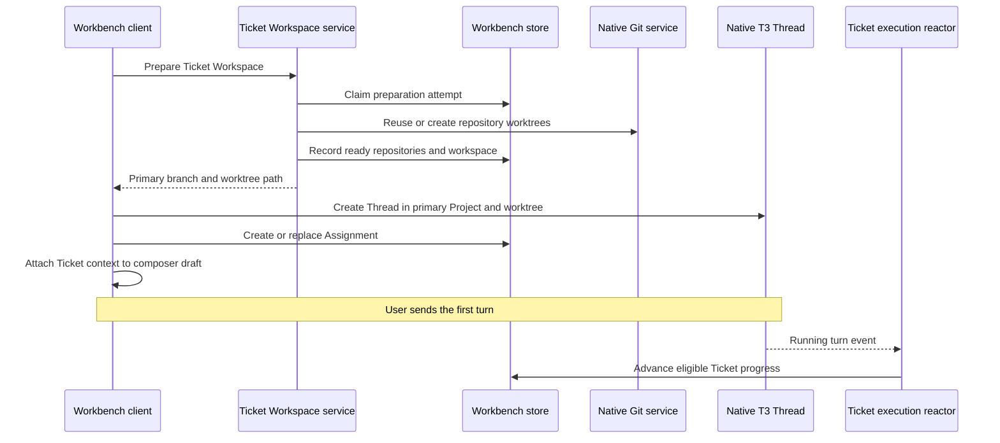

# Ticket execution and workspace lifecycle

A Workbench Ticket owns planning state and an ordered set of native T3 Project references. Its primary Project must be in that set. A Ticket Workspace owns the Git worktrees prepared for those repositories. An Assignment links the Ticket to a native T3 Thread; Workbench does not copy the Thread or its provider session. These records share one server environment. See the [Workbench contracts](../../packages/contracts/src/workbench.ts) and [repository scope validation](../../packages/workbench/src/WorkbenchStore.ts).

## Starting work

The [client coordinator](../../apps/web/src/workbench/startWorkbenchTicket.ts) prepares the Workspace before it creates a Thread. Preparation reconciles each selected repository's current branch. It reuses an intact recorded worktree and creates worktrees only for new repositories. A missing, unregistered, or detached recorded worktree stops preparation without automatic cleanup; the initial branch does not define worktree identity. The Thread uses the primary repository's branch and path. Secondary worktrees remain Ticket context and can open in the preferred editor; they are not provider writable roots. The [workspace service](../../packages/workbench/src/TicketWorkspaceService.ts) owns preparation, recovery, and release, while the [server host adapter](../../apps/server/src/workbench/TicketWorkspaceService.ts) supplies native Git and Project/Thread reads.

The native Thread must exist before the [store accepts its Assignment](../../packages/workbench/src/WorkbenchStore.ts). The store verifies that the Thread belongs to the Ticket's primary Project and is not already assigned. A Ticket can have several active Assignments, but a Thread belongs to only one Assignment. Replacing an Assignment atomically supersedes the selected active link and retains its Thread ID as history. If Assignment persistence fails after Thread creation, the client requests deletion of that orphan Thread. Once assigned, a failed first turn does not delete the Assignment or Thread. Ticket context waits in the composer until the user sends.

Creating an Assignment does not change Ticket progress. A [reactor](../../apps/server/src/workbench/TicketExecutionReactor.ts) observes a native Thread's running turn and asks the [execution service](../../packages/workbench/src/TicketExecutionService.ts) to advance an assigned, active `todo` Ticket. Local Tickets move to `in_progress` in the [store](../../packages/workbench/src/WorkbenchStore.ts); Jira-owned Tickets use the Jira write path. Other progress changes remain separate from agent activity.

## Workspace and history boundaries

| Boundary                   | Behavior                                                                                                                                                                                                                                                   |
| -------------------------- | ---------------------------------------------------------------------------------------------------------------------------------------------------------------------------------------------------------------------------------------------------------- |
| Preparation                | The server serializes preparation per Ticket and records an attempt ID for each newly prepared repository. A failed attempt tries to remove its new worktrees while retaining previously ready ones; removal failures remain recorded for recovery.        |
| Interrupted preparation    | A retry after five minutes may reconcile an incomplete attempt. Recovery checks for native Threads using the paths before removing partial worktrees.                                                                                                      |
| Changed repository scope   | Newly selected repositories get worktrees on the next preparation. Removed repositories keep their worktrees; a new primary Project does not move existing Threads. Repository edits and Assignment changes cannot race with preparation or release.       |
| Release                    | The store claims `releasing` before filesystem changes. Release requires clean worktrees and no linked native Threads using their paths; normal release does not force removal. A retry tolerates a worktree already removed before persistence completed. |
| Deleted or archived Thread | An archived Thread can be restored through native T3 commands. If an active Thread is deleted, starting a replacement supersedes only its Assignment; historical links remain available.                                                                   |

These safeguards are implemented in the [workspace service](../../packages/workbench/src/TicketWorkspaceService.ts), [Assignment store](../../packages/workbench/src/WorkbenchStore.ts), and [client start flow](../../apps/web/src/workbench/startWorkbenchTicket.ts). Snapshot decoding has defaults for older servers. Ticket edits, archive, and deletion use a server-controlled revision so stale clients cannot silently overwrite changes.

## Progress and activity

Ticket progress is persisted as `todo`, `in_progress`, or `done`. Workbench derives agent activity from native Thread shells in the [client projection](../../apps/web/src/workbench/workbench.logic.ts), without a separate persisted agent lifecycle. Waiting for input takes priority over Working, which takes priority over Ready for review when a Ticket has multiple active Threads. A completed turn can show Ready for review while Ticket progress remains `in_progress`; Jira flagged state is independent of both.
