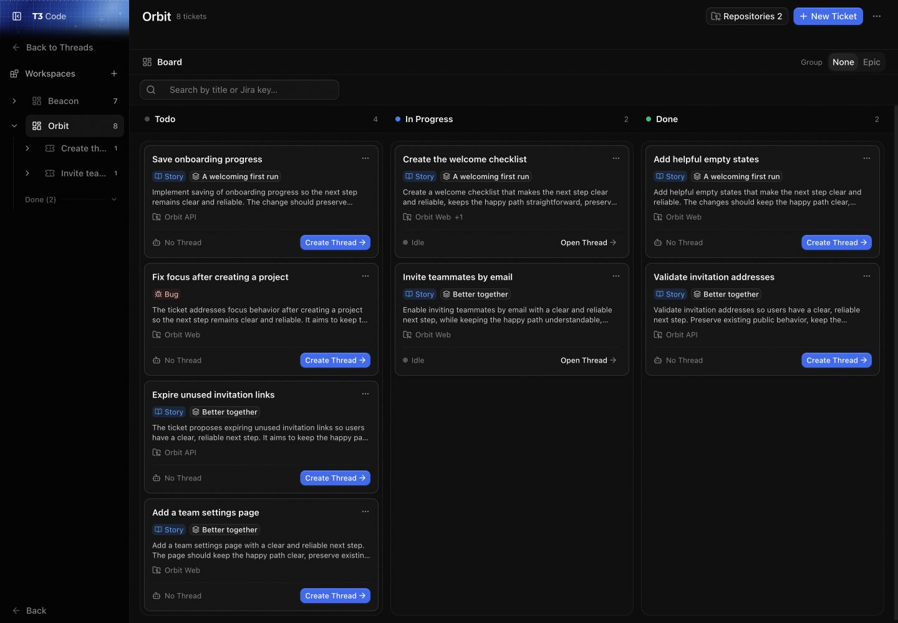
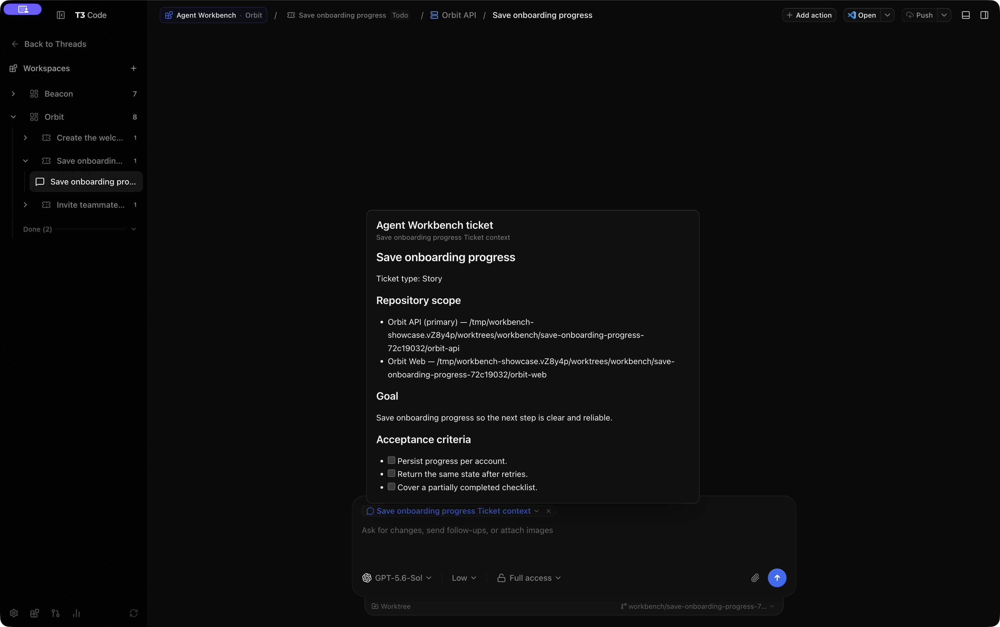
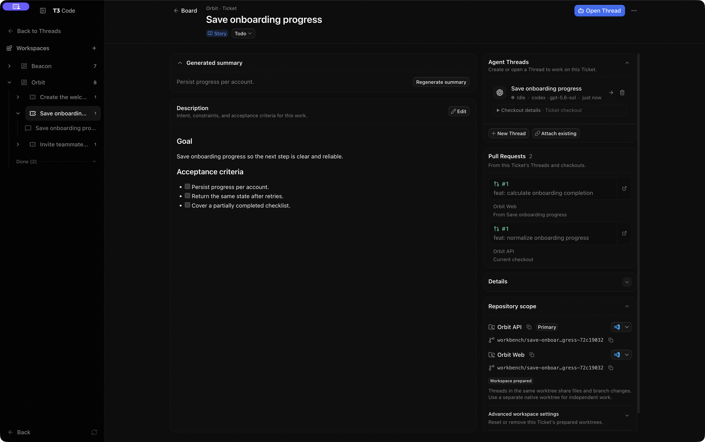
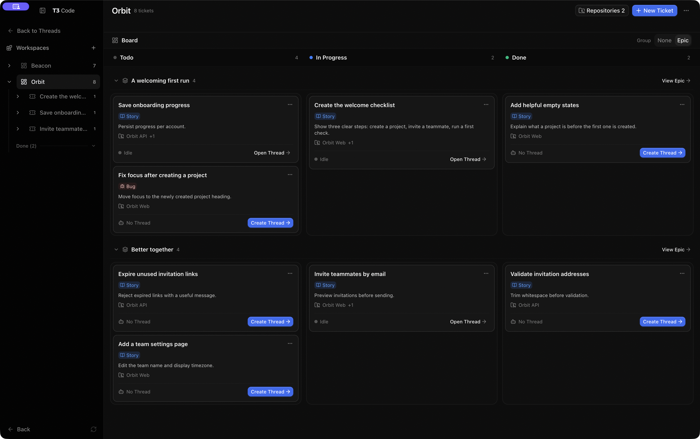
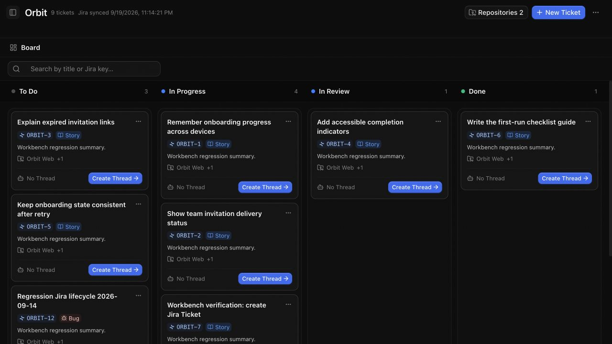

# Workbench user guide

Workbench connects planning to implementation. Group repositories into a Workspace, create Tickets, and work on them in native T3 Threads.

Workbench is available in the web and desktop clients. Jira is optional. Each connected T3 environment has its own Workspaces and Tickets; boards do not combine records from different environments. There is no dedicated Workbench mobile interface yet.



The examples use fictional Orbit and Beacon projects in an isolated desktop environment. The repository worktrees and linked demo pull requests are real.

## In this guide

- [Create your first Workspace and Ticket](#create-your-first-workspace-and-ticket)
- [Start agent work](#start-agent-work)
- [Track progress and review results](#track-progress-and-review-results)
- [Edit and organize Tickets](#edit-and-organize-tickets)
- [Manage repositories and Threads](#manage-repositories-and-threads)
- [Connect Jira](#connect-jira)
- [Troubleshooting](#troubleshooting)

## Create your first Workspace and Ticket

A **Workspace** groups T3 Projects that belong together. A **Ticket** describes work to do. An **Epic** groups related Tickets.

1. Add the repository directories you need as T3 Projects.
2. Open **Agent Workbench** from the sidebar.
3. Choose **Add Workspace**, name it, select its Projects, then choose **Create Workspace**.
4. Open the Workspace's Board, choose **New Ticket**, and select Story or Bug.
5. Enter a title and description. Use the Markdown template to describe the work and acceptance criteria.
6. Select the repositories the Ticket needs and choose its primary repository.
7. Choose **Create Ticket**.

The primary repository is where new Threads open. A Ticket can also include other repositories for work that spans several codebases.

To rename the Workspace or add repositories later, choose **Edit Workspace** in the Board header. Select the additional Projects and choose **Save changes**. Existing Tickets and Threads keep their repository scope.

## Start agent work

1. Open a Ticket from the Board.
2. Check **Repository scope**, including the primary repository.
3. Choose **Create Thread** and select a provider, model, and model options.
4. Review the Ticket context chip in the native Thread composer.
5. Add any further instructions, then send your message.

**Creating a Thread does not start an agent turn.** Workbench prepares one Git worktree per selected repository and opens the Thread in the primary repository's worktree. The context chip supplies the Ticket description and repository paths when you send.

Select the context chip to inspect what the agent will receive. In this example, one Ticket includes separate Orbit API and Orbit Web worktrees.



Watch: start on the Orbit Board, create a Ticket with both repositories, then create a Thread and inspect its context.

https://github.com/user-attachments/assets/027521c7-6113-49a1-8b2c-c54640ce9d8b

Use **New Thread** for another conversation on the same Ticket. Each new Thread starts with Ticket context and waits for you to send.

### Navigate between planning and conversations

Opening a Thread from a Ticket keeps the Workbench sidebar and Workspace context visible. Use the Board or Ticket links to return to planning.

Choose **Back to Threads** to restore the regular T3 sidebar while keeping the conversation open. Opening a linked Thread through normal T3 navigation also uses that sidebar. Its Board and Ticket links return to the owning environment.

## Track progress and review results

Ticket progress and agent activity answer different questions:

| Indicator                                    | Meaning                                                                        |
| -------------------------------------------- | ------------------------------------------------------------------------------ |
| To Do, In Progress, Done                     | How far the Ticket's work has progressed.                                      |
| Waiting for input, Working, Ready for review | What the linked agent activity needs now.                                      |
| Jira flagged                                 | Jira has flagged the issue; this is separate from progress and agent activity. |

When a linked Thread starts executing a turn, a To Do Ticket moves to In Progress. Creating or opening a Thread does not change progress.

**A completed agent turn does not mark the Ticket Done.** Review the result, then update progress from the Ticket or Board card menu when the work is accepted.

For Jira Tickets, Workbench first applies an available Jira transition. If that transition fails, the Thread continues and its work log shows a warning.

### Track pull requests across repositories

The Ticket's **Pull Requests** section collects PRs from its linked Threads and repository checkouts. A change spanning an API and web app can have both PRs visible in one place.

To attach a PR yourself:

1. Open the Ticket's Thread.
2. Open the command palette with **⌘K** on macOS or **Ctrl+K** on Windows and Linux.
3. Choose **Link pull request to thread**, paste the full PR URL, and choose **Link**.
4. Return to the Ticket to see its PRs together.

Once the Thread has a linked PR, you can also open **Linked pull requests** in the right panel and choose **Link** to add another.

Use a full URL for a PR in another repository. A number such as `#42` refers to the Thread's own repository. The environment needs a Project with access to the PR's host.



Watch: open a Ticket's Thread, link a PR through the command palette, and return to the Ticket to see the linked pull request.

https://github.com/user-attachments/assets/d74bb27e-57ce-4e56-9a37-9afab00d62e6

## Edit and organize Tickets

### Update a Ticket's context

Open the Ticket and choose **Edit** to change its title or description. Descriptions display formatting when viewed and show their source when edited.

Unsaved edits remain available when you close the Ticket or switch Workspaces during the current Workbench session. Reopen it to continue, or choose **Cancel** to discard the draft. Text entered while a save is pending remains available for further editing.

For imported Jira Tickets, saving a description writes the change to Jira. Jira permissions still apply.

### Use summaries for a quick overview

Workbench generates a separate summary for Board previews using **Settings → General → Text generation model**. It refreshes the summary when the saved title or description changes.

To retry or replace a summary:

1. Save any unsaved Ticket edits.
2. Choose **Regenerate summary** from the Ticket menu or summary section.

If generation fails, Workbench keeps the previous summary. Summaries do not change Jira fields or replace the full description sent to the agent.

### Group Tickets into Epics

Choose **New Epic** on the Board and assign related Tickets to it. Use Epic swimlanes on the Board to see that work together.



### Archive, restore, or delete local Tickets

| Task                                      | Action                                                                 | Result                                  |
| ----------------------------------------- | ---------------------------------------------------------------------- | --------------------------------------- |
| Hide a local Ticket from the active Board | Choose **Archive Ticket** in its detail view.                          | The Ticket can be restored later.       |
| Restore an archived Ticket                | Open the sidebar’s **Archived** section and choose **Restore Ticket**. | The Ticket returns to the active Board. |
| Remove a local Ticket                     | Choose **Delete Ticket** in its detail view.                           | The Ticket is removed from Workbench.   |

Archiving or deleting a Ticket keeps its native Threads and repository worktrees. Imported Jira Tickets cannot be archived or deleted locally.

## Manage repositories and Threads

### Understand shared worktrees

Threads using the same Ticket worktree share its files and branch changes. Use a separate native worktree when you need independent work.

The Ticket shows each repository's directory and latest reported branch. These refresh when you open the Ticket or return to the window. Linked Threads show their actual checkout and whether they share a Ticket worktree.

New worktrees and branches have readable names based on the Ticket title and, when available, its Jira issue key, with a unique suffix. Naming does not wait for text generation. Existing worktree paths and branch names are retained.

Creating a Workbench **Workspace** groups existing Projects; it does not create repository directories. **Create Thread** prepares the Ticket's directories. For a new two-repository Ticket, the layout looks like this:

```text
worktrees/workbench/save-onboarding-progress-<suffix>/
├── orbit-api/
└── orbit-web/
```

Each directory is a Git worktree for its own repository. Workbench initially creates the same Ticket branch name in both. **Repository scope** shows their paths and branches; the primary repository is where the Thread starts.

### Change a Ticket's repositories

Open **Repository scope** to change the selected repositories or primary repository, even after creating Threads.

- Added repositories receive worktrees when you create another Thread.
- Existing Threads retain their working directory and previously sent context.
- Removing a repository from the selection leaves its worktree on disk.
- Branch changes made in native Threads are retained when you create another Thread.

Repository edits are temporarily unavailable while Workbench prepares or releases worktrees.

### Attach or reopen a Thread

Use **Attach existing** to link an unassigned conversation from the Ticket's primary repository. This does not change the conversation's content or checkout.

Choose **Open Thread** to reopen an archived linked Thread; Workbench restores it to T3's active Thread list. Earlier conversations remain accessible through **Thread history**.

If a Thread was deleted, **Create Thread** starts a replacement and retains the previous link in the Ticket's history. Deleting a linked Thread uses T3's confirmation flow and preserves shared Ticket worktrees.

### Reset a Ticket's worktrees

Use a reset when you need to remove and prepare the Ticket's worktrees again.

1. Delete all linked Threads, including archived Threads and those in **Thread history**.
2. Commit or otherwise preserve any local worktree changes, then make sure the worktrees are clean.
3. Open **Repository scope** and choose **Reset ticket workspace**.
4. Review and confirm the removal.

Reset removes the worktrees but keeps the Ticket, Git branches, and commits. The next **Create Thread** prepares the worktrees again.

## Connect Jira

A Workspace can import issues assigned to the connected Jira user from a board and selected sprints. The board can span several Jira projects. Imported Tickets show a Jira badge with a link to the issue.

Published Workbench desktop previews include a hosted Jira connection. You authorize access on Atlassian's website; you do not need to create your own OAuth app. For a source-based development environment, follow the [local Jira setup instructions](../../README.md#set-up-jira-for-local-development).

### Set up a sprint mirror

1. Open the Workspace, choose **Connect Jira**, then **Connect Atlassian**.
2. Authorize access on Atlassian's website, then choose the site and board.
3. Select one or more sprints. **Select all** selects the sprints currently listed.
4. Set the default repository scope for imported Tickets.
5. Map Jira statuses to Workbench columns, or enable **Mirror Jira states** to use the board's column names and order.
6. Save the configuration.

An issue in more than one selected sprint appears only once. Importing creates Tickets, not worktrees. Before starting a Thread, check that Ticket's **Repository scope**.

The Orbit example mirrors six assigned Jira issues into the same Workspace as its local Tickets. Jira issue keys identify imported work. Both Orbit API and Orbit Web are selected as the default repository scope.



### Sync and follow sprints

Choose **Sync Jira** for an immediate refresh. An active mirror also checks Jira every five minutes while its server is running. Open Boards refresh automatically and when the app regains focus, including Workspaces without Jira.

Watch: change ORBIT-4 from In Review to Done in Jira, return to the Orbit Board, and choose **Sync Jira**. Open the mirrored Ticket to confirm its updated status.

https://github.com/user-attachments/assets/4133a8d1-504e-4cbd-a517-48e6f35899ef

With **Follow selected sprints automatically** enabled, Workbench keeps active selected sprints and replaces closed ones when it can identify a complete successor selection. It keeps the previous Board and reports an error if replacements are missing or ambiguous. A sprint already observed running alongside the selection is not considered a successor.

Turn off automatic following to keep the same sprint selection. **Select all** does not include unrelated future sprints automatically.

You can pause the mirror and resume it later without removing its Tickets or configuration. If any selected sprint fails to sync, Workbench keeps the previous Board rather than applying a partial update.

### Create a Jira Ticket

In a Jira-linked Workspace, **New Ticket** creates an issue in the configured Jira project and assigns it to your connected account. Select a sprint if the Workspace mirrors more than one. The chosen repositories stay attached to the Workbench Ticket.

Resume a paused mirror before creating a Ticket. If Workbench reports missing Jira permissions, reconnect Jira and authorize the requested access. If Jira created the issue but syncing fails, retry the same open form to resume the saved request. If the outcome is unknown, check Jira before starting another creation.

OAuth scopes and Jira project permissions are separate. The connected Jira user needs Browse projects and Create issues to create a Ticket. Assign Issues may be required to assign it to the connected account. Edit issues is required to save a description, and Transition issues is required to change its status. See Atlassian's [Jira issue REST permissions](https://developer.atlassian.com/cloud/jira/platform/rest/v3/api-group-issues/), [Jira project permission reference](https://support.atlassian.com/jira-cloud-administration/docs/permissions-for-company-managed-projects/), and [Jira Software OAuth scopes](https://developer.atlassian.com/platform/forge/manifest-reference/scopes-product-jsw/) for the exact requirements. If the Jira connection predates issue creation support, choose **Reconnect Jira** to grant `read:jira-user` and `write:sprint:jira-software`.

### Know what sync changes

| Jira controls                                                         | Workbench controls                                                               |
| --------------------------------------------------------------------- | -------------------------------------------------------------------------------- |
| Issue descriptions, status, Epic relationships, and sprint membership | Repository selections, Ticket worktrees, linked Threads, and generated summaries |

Saving an imported Ticket's description or changing its progress writes to Jira before Workbench reports it as synced. Changes made in Jira appear on the next successful sync. When mirroring board columns, changes to those columns are also picked up on sync.

Status choices use the transitions Jira currently allows. A destination must be mapped to Workbench before you can select it. Agent activity remains separate from Jira status.

Issues that leave the selected sprints disappear from the active Board but remain in Workbench history with their linked work.

### Reconnect Jira

If access expires, is revoked, or lacks issue-editing permission:

1. Open the mirror settings and choose **Reconnect Jira**.
2. Authorize access on Atlassian's website.
3. Use the same Jira site to retain the mirror and Ticket history.

Cancelling authorization leaves the existing mirror unchanged.

## Troubleshooting

| Problem                                                     | What to check                                                                                                                                           |
| ----------------------------------------------------------- | ------------------------------------------------------------------------------------------------------------------------------------------------------- |
| A repository is missing when editing a Workspace            | Add its directory as a T3 Project first.                                                                                                                |
| The agent has not started after creating a Thread           | Send a message; creating the Thread only prepares the conversation.                                                                                     |
| A completed turn leaves the Ticket In Progress              | Review the result and change progress yourself.                                                                                                         |
| A generated summary fails                                   | Check the text generation model setting, save edits, then regenerate.                                                                                   |
| A recorded Ticket worktree is missing                       | Delete linked Threads, reset the Ticket workspace, then create a Thread again.                                                                          |
| A worktree directory exists but is detached or unregistered | Restore its branch checkout or Git worktree registration. Workbench will not remove that directory automatically.                                       |
| Jira cannot advance to the next sprint                      | Review the reported error and choose a valid sprint selection in mirror settings.                                                                       |
| Workspaces or Tickets seem to be missing                    | Check the connected environment. Each environment has its own records. The installed Workbench fork also has separate saved data from official T3 Code. |

For connecting another device, see [Remote access](./remote-access.md).
