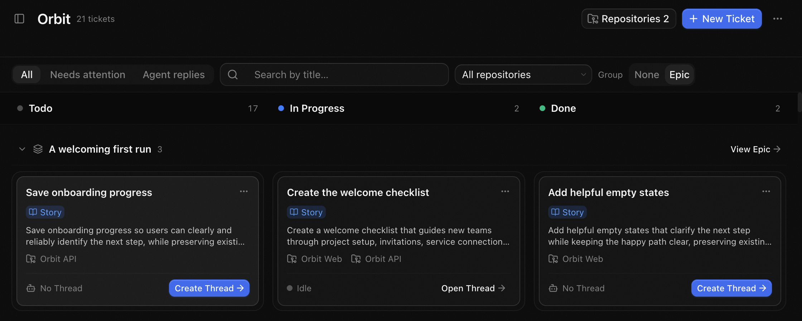
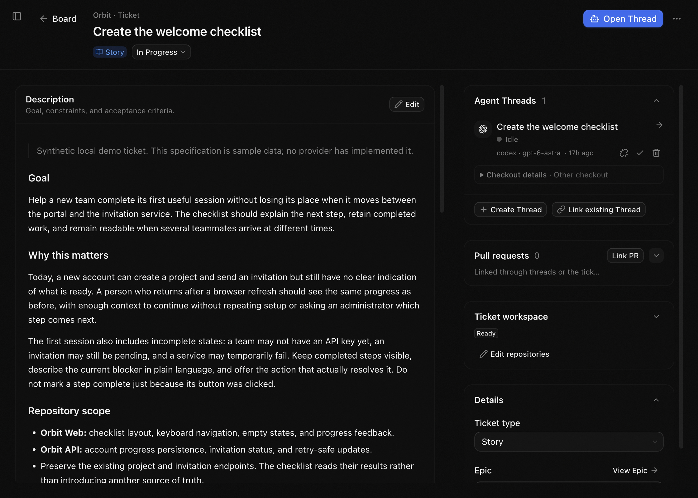
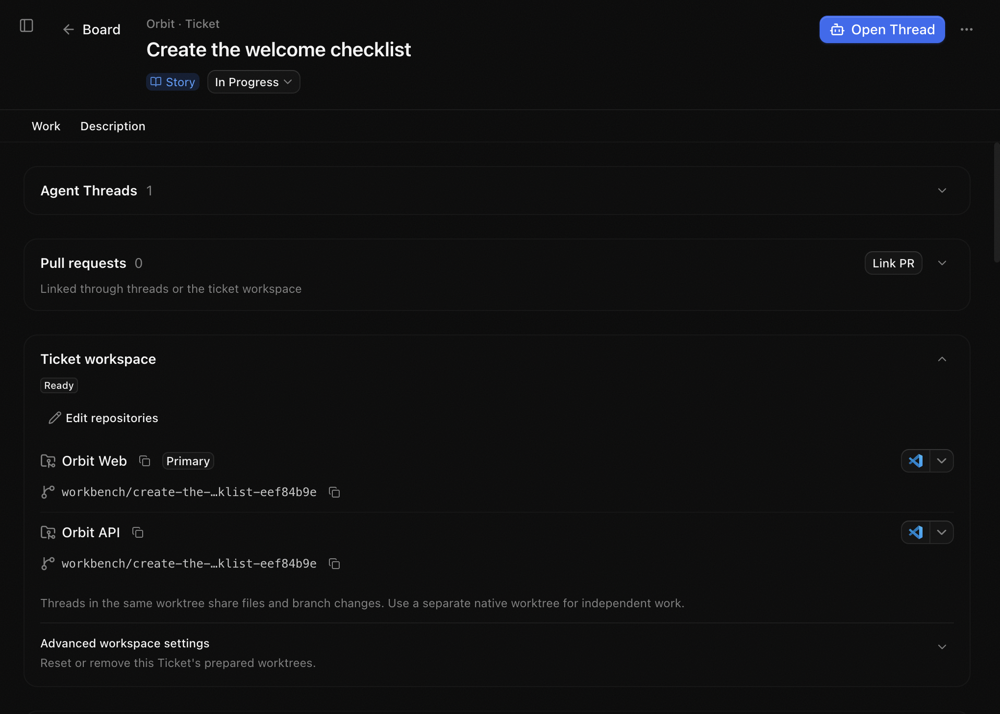
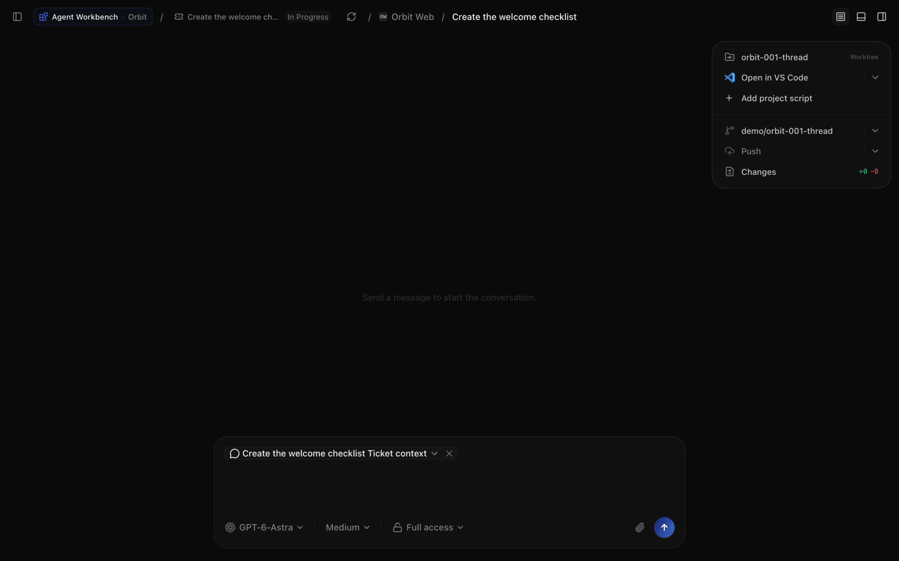
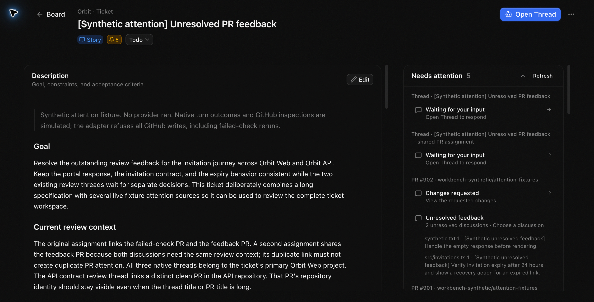
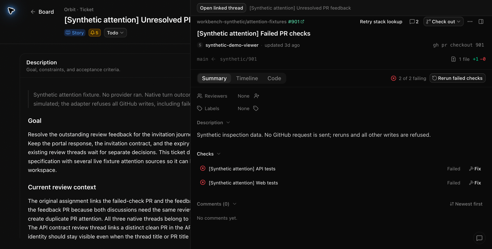
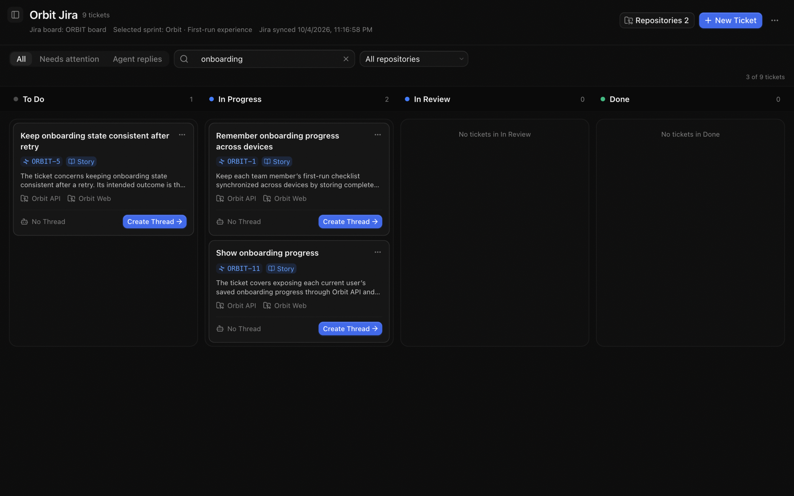

# Workbench user guide

Workbench gives you one view of work across repositories: what’s to do, in progress,
and done. Each Ticket brings together its context, agents, pull requests, and an
isolated workspace with worktrees for the repositories involved.

Workbench is available in the web and desktop clients. Jira is optional. Each T3
environment has its own Workspaces and Tickets, so records do not appear across
environments. There is no dedicated Workbench mobile interface yet.

The screenshots use fictional Orbit and Beacon projects in an isolated demo.
Prepared Git worktrees are real. Conversation outcomes and PR inspection data
are sample states, not evidence that an agent completed the work.

For a tabbed overview, open the [screenshot walkthrough](https://filipgutica.github.io/t3code/#walkthrough-heading).

## Create a Workspace and Ticket

A **Workspace** groups T3 Projects that belong together. Linked Projects must point
to Git repositories. A **Ticket** describes work to do; an **Epic** groups related
Tickets.

1. Add the repositories you need as T3 Projects.
2. Open **Agent Workbench**, choose **Add Workspace**, select the Projects, and
   choose **Create Workspace**.
3. Open the Workspace Board and choose **New Ticket**.
4. Enter a title and description, select the repositories, and choose the primary
   repository.
5. Choose **Create Ticket**.

The primary repository is where new Threads open. A Ticket can include other
repositories when the work spans several codebases. Use **Edit Workspace** to
rename a Workspace or change its repository list; existing Tickets and Threads
keep their scope.

## Archive or delete a Workspace

Choose **Archive Workspace** from the Workspace actions menu to hide it from the
active list and attention counts. Open **Archived Workspaces** in the sidebar to
inspect its Tickets and Epics. Archived planning is read-only, Jira sync is paused,
and linked native Threads remain available. Choose **Restore Workspace** to resume
planning. Restoration keeps individual Ticket and Epic archive states and the
Jira sync's previous active or paused setting.

Choose **Delete Workspace** from the same menu and review the Ticket and Epic
counts before confirming. Deletion permanently removes the Workspace's planning
data and Jira mirror from Workbench. Native Projects, Threads, Git worktrees,
branches, commits, and Jira issues remain. There is no undo. **Retained worktrees**
in the sidebar remains available for cleanup even after deleting the last Workspace.

## Start agent work

1. Open a Ticket and choose **Create Thread**.
2. If the workspace is not prepared, review the primary and additional repositories.
   Select a provider and model, then choose **Create workspace and thread**.
   Prepared workspaces show the repositories that the new Thread will reuse.
3. Review the Ticket context chip in the native Thread composer.
4. Add instructions and send the message.

Creating a Thread does not start an agent turn. Workbench prepares one Git
worktree per selected repository and opens the Thread in the primary repository's
worktree. The context chip includes the Ticket description and repository paths.

To prepare worktrees before opening a conversation, choose **Prepare workspace**
in **Ticket workspace**, review the repositories, and confirm.

After changing the Ticket, use **Attach current Ticket context** in an existing
Thread to stage its saved requirements and current checkout paths. Review the
context chip and send when ready; attaching context does not send a message.

Use **Create Thread** for another conversation on the same Ticket. Use **Link existing
Thread** to add an unassigned native conversation, or **Unlink Thread from Ticket**
to remove the association without deleting it. **Settle** moves a conversation out
of the active group; **Thread history** keeps earlier conversations available.

Opening a Thread from a Ticket keeps the Workbench context visible. Use the Board
or Ticket links to return to the work, or choose **Back to Threads** to restore the
regular T3 sidebar. The command palette also offers **Open Workbench**, **New
Ticket** for the current Workspace, and **Back to Ticket** from a linked Thread.

## Follow progress and review results

Ticket progress and agent activity describe different states:

| Ticket progress          | Agent activity                            |
| ------------------------ | ----------------------------------------- |
| To Do, In Progress, Done | Waiting for input, Working, Agent replied |

When a linked Thread starts a turn, a To Do Ticket moves to In Progress. **A
completed agent turn does not mark the Ticket Done.** Review the result, then set
the Ticket progress from the Ticket or Board card menu when the work is accepted.
For Jira Tickets, Workbench attempts an available Jira transition first; if it
fails, the Thread continues and its work log shows a warning.

Use **Needs attention** on the Board to find waiting Threads, work ready for review,
failed PR checks, and unresolved PR conversations. **Agent replies** narrows the
view to completed agent work awaiting review. PR inspection covers explicitly
linked PRs; the Board shows incomplete or unavailable coverage and lets you refresh.

Click a Ticket's attention bell to see each reason and open its Thread, failed
checks, requested changes, or unresolved discussion. The Ticket page keeps these
actions in its **Needs attention** section. Counts represent actionable signals,
not unread messages; opening the list does not clear them.

Opening a Thread acknowledges its notification. An unanswered question stays
**Waiting for input** until you respond. PR actions remain until the checks or review
feedback are resolved.

The Ticket's **Pull Requests** section collects PRs reported by linked Threads and
prepared worktrees. For Jira Tickets, it also searches linked repositories for the
issue key. To attach a PR yourself, choose **Link PR** from the Ticket, select a
Thread if prompted, then choose a listed PR or search by title. You can paste a full
PR URL when browsing is unavailable or the PR is not listed. A number such as `#42`
refers to the selected Thread's repository. Link PR needs a live assigned Thread and
a project with a supported Git remote in the same environment. You can also use
**Link pull request to thread** in the native Thread's command palette.

For a GitHub PR with failing checks, open its native PR panel and choose **Rerun
failed checks** to request failed-job reruns for its current head. This requires
GitHub Actions write permission. A successful request does not mean the checks
have passed; refresh the PR to follow the results.

## Edit and organize Tickets

Use Board search to find loaded Tickets by title, or by Jira key on connected
Boards. Filter by any repository in their scope. Search, repository filtering,
grouping, and the selected Board column are retained per Workspace when returning
from a Ticket. Open a Ticket and choose **Edit** to change its title or description.
Saved descriptions display formatting; imported Jira descriptions are also written
to Jira. Board previews use a separate summary generated from **Settings → General → Text generation
model**. Regenerate it from the Ticket menu when needed; the summary does not
replace the full description sent to the agent.

Choose **New Epic** from the Workspace actions menu, assign related Tickets, and
use the Board's **Group** toggle to show Epic swimlanes. On desktop, drag local
Tickets between status columns. Jira-managed Tickets use Jira's transition flow.

Archive a local Ticket to hide it from the active Board, or restore it from
**Archived**. Deleting a local Ticket removes it from Workbench but keeps its
native Threads and repository worktrees. Imported Jira Tickets cannot be archived
or deleted locally.

## Manage repositories and worktrees

Choose **Edit repositories** in **Ticket workspace** to change the primary or
additional repositories. Changes stay local until you choose **Save changes**;
**Cancel** restores the saved choices. Adding repositories to a prepared workspace
prepares their worktrees together after saving.

Threads using the same Ticket worktree share its files, branch, and uncommitted
changes. Existing Threads keep their working directory and sent context when the
Ticket's repository scope changes. Adding a repository to an already prepared
workspace prepares its worktree; removing one keeps its worktree and local
changes so it can be added again later.

Creating a Workspace groups existing Projects; it does not create repository
directories. **Prepare workspace** creates worktrees without opening a Thread, and
**Create Thread** prepares missing worktrees and reuses existing ones. Creating,
importing, or viewing a Ticket alone does not prepare worktrees.

To remove prepared worktrees, delete Threads that still use them, including archived
Threads. Unlink Threads working elsewhere. Commit or preserve local changes, then open **Ticket
workspace → Advanced workspace settings → Remove prepared worktrees** and confirm.
The reset removes worktrees but keeps the Ticket, branches, and commits.

After deleting a Ticket or Workspace, open **Retained worktrees** in the Workbench sidebar to
remove its kept worktrees. Review the listed repository paths, choose **Remove**,
and confirm. The same Thread ownership and local-change checks apply.

## Connect Jira

A Workspace can import issues assigned to the connected Jira user from a board and
selected sprints. Imported issues become Tickets and show a Jira link; importing
does not create worktrees. A published Workbench desktop release uses a hosted Jira
connection, so authorization happens on Atlassian's website without creating an
OAuth app. For a source-based environment, see the [local Jira setup
instructions](../../README.md#set-up-jira-for-local-development).

To connect a Workspace, choose **Connect Jira → Connect Atlassian**, authorize on
Atlassian's website, then select the site, board, sprints, default repository scope,
and status mapping. **Mirror Jira states** uses the board's column names and order.
If the Workspace has local Tickets or Epics, choose whether to publish them to Jira
or delete them before importing. Deleting requires an exact-count confirmation;
native Agent Threads remain in history. Save the configuration to start the first
sync.

Use **Sync Jira** for an immediate refresh. Jira controls issue descriptions,
status, Epic relationships, and sprint membership. Workbench controls repository
selection, Ticket worktrees, linked Threads, and generated summaries. Changes made
in Jira appear on the next successful sync; issues that leave the selected sprints
leave the active Board but remain in Workbench history.

**New Ticket** in a Jira-linked Workspace lets you choose **Jira** or **Local only**.
Jira creates an issue in the configured project and selected sprint, assigned to the
connected account. Local-only Tickets stay in Workbench and can be created while
Jira sync is paused. Tickets show **Local** or their Jira issue key on the Board,
in the sidebar, and in Ticket details.

To publish a local Ticket, choose **Publish to Jira** in its details or Board menu.
Select a sprint and, optionally, a Jira Epic, then confirm. Publishing keeps the
Ticket's linked Threads and worktrees. Jira then controls its description, status,
and Epic relationship.

If access expires, choose
**Reconnect Jira**, authorize again, and use the same site to retain the mirror and
Ticket history. Cancelling authorization leaves the existing mirror unchanged.

## Troubleshooting

| Problem                                           | What to check                                                                                |
| ------------------------------------------------- | -------------------------------------------------------------------------------------------- |
| The agent has not started after creating a Thread | Send a message; creation only prepares the conversation.                                     |
| A completed turn leaves the Ticket In Progress    | Review the result and update progress yourself.                                              |
| A repository is missing from a Workspace          | Add its directory as a T3 Project first.                                                     |
| A prepared worktree is missing                    | Remove Threads that use it, reset the Ticket workspace, then prepare again.                  |
| Jira cannot advance or import issues              | Check the selected board, sprints, assignment, and Jira permissions, then reconnect or sync. |
| Workspaces or Tickets seem to be missing          | Check the connected environment; each environment has separate records and saved data.       |

For connecting another device, see [Remote access](./remote-access.md).
